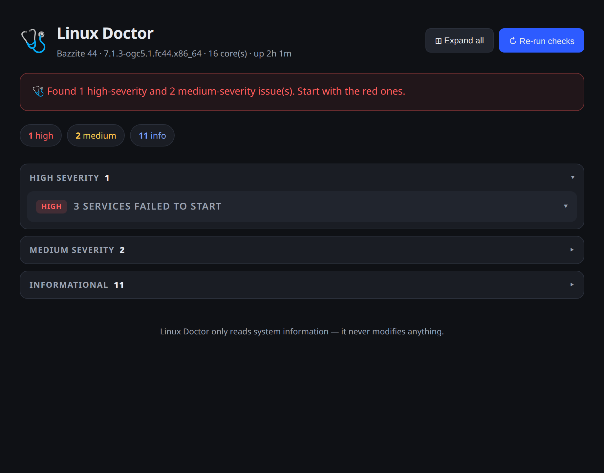

# 🩺 Linux Doctor

[](https://github.com/sponsors/zShaD0w7x)

**Checks for your Linux system.**

Linux Doctor runs a battery of read-only checks (memory, CPU, disk, services, logs, suspend/resume, security, updates, processes, battery), finds the problems that actually matter, explains them in clear **American English**, and tells you exactly how to fix them.

No more copy-pasting scary `journalctl` output into a forum. Instead:

```
Your system is low on usable memory: 9.4 GB of 15 GB is in use and 2.2 GB is
being pushed to swap. This is the most common cause of a sluggish desktop.
How to fix: close unused browser tabs, then re-run this check.
```

## Screenshots



The `--web` dashboard: a green/red status banner, severity chips, and one expandable section per severity — high-severity findings are open by default, medium/info collapse so the whole report fits on screen. Each finding expands to its explanation, **Evidence**, and a **Copy** button next to the fix.

## Why it exists

Linux diagnostics are cryptic. `journalctl` speaks in hieroglyphics, and most users end up running commands a stranger on Reddit told them to run. Linux Doctor is the difference between *"SELinux denied access on /proc/swaps"* and *"your system is slow because Brave is using 41% of your CPU."*

## Safety

- **Read-only, always.** Linux Doctor inspects the system but never modifies anything. Fixes are shown as suggestions — it never runs them for you.
- No dependencies. Node.js ≥ 20 is all you need.

## Install & run

```bash
node bin/doctor.js            # run from this directory
# or, from anywhere:
npm install -g . && linux-doctor
```

Native packages (no Node needed on PATH):

- **Arch / AUR:** `linux-doctor` — [PKGBUILD](packaging/PKGBUILD)
- **Fedora / RHEL / openSUSE:** build an RPM with the [linux-doctor.spec](packaging/linux-doctor.spec)

See [packaging/README.md](packaging/README.md) for details.

Shell completions (bash/zsh/fish) are in [completions/](completions/). Install them with:

```bash
# bash
install -Dm644 completions/linux-doctor.bash /usr/share/bash-completion/completions/linux-doctor
# zsh
install -Dm644 completions/linux-doctor.zsh /usr/share/zsh/site-functions/_linux-doctor
# fish
install -Dm644 completions/linux-doctor.fish ~/.config/fish/completions/linux-doctor.fish
```

To run checks automatically, enable the systemd timer:

```bash
sudo cp packaging/linux-doctor.{service,timer} /etc/systemd/system/
sudo systemctl daemon-reload
sudo systemctl enable --now linux-doctor.timer
```

## Options

```
--check <id>   run only the given check(s) — comma-separated or repeated, e.g. --check memory,disk
--list         list the checks by category without running them
--json         machine-readable JSON output (great for scripting)
--plain        plain, tab-separated text — no colors/emoji, grep-friendly
--web          open the visual dashboard in your browser (recommended)
--ai           add an AI summary in plain English (needs LLM_API_KEY)  --html <path>  save a standalone HTML report (open in any browser)
  --push <url>   post the report to a fleet server (FLEET_API_KEY optional)
  --ignore <txt> hide findings whose title contains <txt> (see Ignore list below)
--schema       print the JSON Schema for --json output (v1)
--profile      append per-check durations to the report
--help         usage
--version      version
```

## Visual dashboard

```bash
linux-doctor --web
```

Opens a dashboard in your browser at `127.0.0.1`: a status banner, severity chips, and one expandable section per severity. **High** findings are open by default; **Medium** and **Info** collapse into a single row each, so a full report fits on one screen without scrolling. Click any finding to expand its explanation, **Evidence**, and a **Copy** button next to the fix. **Expand all / Collapse all** toggles everything at once. Hit **Re-run checks** for a fresh report. Pure HTML/CSS/JS — no frameworks, no build step.

**Dark/light theme:** the dashboard follows your system theme and remembers your choice — the 🌓 button in the header cycles light → dark → auto. **Keyboard navigation:** `↑`/`↓` move between findings, `Enter` opens/closes the focused one. The palette is color-blind friendly: every severity has an icon (🔴 🟡 🔵) plus a text label, never color alone. While checks re-run, a spinner shows progress and the button is disabled.

Exit code: `0` if nothing serious was found, `1` if there are high/medium findings, `2` on errors — so you can use it in scripts and cron jobs.

## Plain output (`--plain`)

```bash
linux-doctor --plain
```

Prints the same report as plain, tab-separated lines — no colors, emoji, or box drawing — so it works in dumb terminals and pipes cleanly into `grep`/`awk`. Metadata goes to `#` comment lines; each finding is one `severity<TAB>number<TAB>title` row with `detail`/`fix` rows right after:

```
# linux-doctor
# system: Bazzite 44 · kernel 6.1.0 · 16 core(s) · up 2h
# score: 53/100
# summary: 1 high, 4 medium, 12 info
high    1   3 services failed to start
fix     1   Inspect one with `systemctl status ...`
```

Exit codes are the same as the normal report, so `--plain` works in cron and scripts too.

## Desktop app (GUI)

The same dashboard, as a native desktop window — launch it, and one click on **Re-run checks** gives you a fresh report. Built with Tauri v2: the window is a thin Rust shell that runs the exact same Node checks (`bin/doctor.js --json`), so there is **zero duplication** between the CLI and the GUI — the checks are the single source of truth.

**Prerequisites:** Node.js ≥ 20 (the checks run through Node), Rust, and the Tauri system libraries:

```bash
# Fedora / Bazzite (immutable) — layering applies live, no reboot needed
sudo rpm-ostree install --apply-live webkit2gtk4.1-devel dbus-devel librsvg2-devel libxdo-devel
# Debian / Ubuntu
sudo apt install libwebkit2gtk-4.1-dev build-essential libssl-dev libxdo-dev librsvg2-dev
```

**Run in development:**

```bash
npm install
npm run gui:dev
```

**Build installers (.deb / .rpm / AppImage):**

```bash
npm run gui:build
```

The bundled app needs `node` on PATH to run the checks. Set `LINUX_DOCTOR_ROOT` to point at a Linux Doctor checkout if the bundled resources are unavailable.

To put the app in your desktop menu, install the launcher (the deb/rpm bundles ship one automatically; this is for the AppImage or manual setups):

```bash
install -Dm644 packaging/linux-doctor.desktop ~/.local/share/applications/
install -Dm644 src-tauri/icons/128x128.png ~/.local/share/icons/hicolor/128x128/apps/linux-doctor.png
```

## Checks

| ID | What it checks |
|---|---|
| `memory` | RAM pressure, swap usage |
| `load` | CPU load vs core count |
| `disk` | Real partitions near full (ignores virtual/immutable roots) |
| `services` | Failed systemd services (system + user) |
| `timers` | Scheduled tasks — enabled systemd timers that never run |
| `journal` | Error log, with known-benign noise filtered out |
| `journald` | System journal (log) disk usage |
| `suspend` | Failed suspend/resume hooks (laptops) |
| `containers` | Container runtimes — podman/docker installed and usable |
| `containerdisk` | Container image storage (podman/docker) — hidden disk usage |
| `crash` | Crash and reboot history (coredumps + unexpected restarts) |
| `security` | Firewall, SELinux, update services |
| `secureboot` | UEFI boot mode, Secure Boot state, TPM presence |
| `network` | Default route and DNS resolution |
| `ntp` | Clock synchronization (time sync daemon state) |
| `updates` | Pending package updates (dnf/apt/pacman) |
| `firmware` | Pending firmware (BIOS/UEFI) updates via fwupd |
| `flatpak` | Pending Flatpak app updates |
| `reboot` | Newer kernel installed but not booted, pending restart |
| `processes` | Top memory consumers, with friendly names |
| `thermal` | CPU temperatures and thermal-throttling events |
| `battery` | Laptop battery level and capacity wear (skipped on desktops) |
| `gpu` | Graphics driver health (NVIDIA proprietary vs nouveau vs missing, software rendering) |
| `bluetooth` | Bluetooth controller presence and daemon state |
| `wayland` | Display session type, running compositor, software rendering |
| `audio` | Sound server (PipeWire/PulseAudio) and output device (desktop/laptop) |
| `backup` | Backup/snapshot tools installed and scheduled (borg, restic, snapper, timeshift…) |
| `hardware` | Machine check exceptions and corrected ECC memory errors |
| `smart` | Disk SMART health (needs root or smartmontools) |
| `luks` | Full-disk encryption (LUKS) presence |

`--list` groups checks by category and marks the ones that do not apply to the
current machine (e.g. `battery` on a desktop) with `(n/a on desktop)` — checks
that only apply to some machine kinds are skipped automatically on a full run,
unless you pick them explicitly with `--check`.

## Caching

The `updates` check refreshes package metadata, which is the slowest thing in a full run (~5s with dnf). Its result is cached for 30 minutes at `~/.cache/linux-doctor/updates.json` (override with `LINUX_DOCTOR_CACHE`; disable with `LINUX_DOCTOR_UPDATES_TTL_MS=0`). A failed check is never cached, so the next run retries. The cache is a bonus, never a dependency — if it cannot be written, the check just runs uncached.

## Health score & history

Every run is saved to `~/.local/share/linux-doctor/history.json` (override with `LINUX_DOCTOR_HISTORY`). From that history Linux Doctor shows:

- **Health score (0–100)**: 100, minus 15 per high-severity and 8 per medium-severity finding. Findings that report the same root cause (e.g. software rendering, detected by both the `gpu` and `wayland` checks) are collapsed into one before scoring, so one problem never counts twice.
- **"New since last check"**: findings whose title did not appear in the previous run get a `(new)` marker in the terminal report, a purple **NEW** badge in the dashboard, and are counted in a `new` chip.

The score and new-count travel with `--json` output and `--push` fleet reports, so a fleet dashboard can show trends over time. The web dashboard draws a small sparkline of your health score from this history. History is a bonus, never a dependency — if it cannot be written, the report still works.

## Ignore list

Tired of the same finding every run? Hide it — per run with `--ignore`, or permanently in the config file (`~/.config/linux-doctor/config.json`, override with `LINUX_DOCTOR_CONFIG`):

```bash
linux-doctor --ignore "Suspend hooks are failing"
# permanent:
cat > ~/.config/linux-doctor/config.json <<'EOF'
{ "ignore": ["Suspend hooks are failing", "fw-fanctrl"] }
EOF
```

Matches are case-insensitive substrings of the finding title, so a short fragment like `fw-fanctrl` works. Ignored findings are dropped from the report, the score, and the history — they simply stop existing. The dashboard has an **Ignore** button on every finding that saves the pattern for you. To un-ignore, edit the config file. The config is a bonus, never a dependency — if it cannot be read, nothing is ignored.

Ignore is never silent: hidden findings are counted (`# ignored: N` in `--plain`, `ignoredCount` in `--json`, "N finding(s) hidden" in the terminal report), and a pattern that matches nothing warns on stderr — so a stale ignore (e.g. after a finding title changed) rots loudly, not silently.

## Tuning thresholds

Every severity threshold has a sane desktop default, but they are all tunable in the same config file:

```jsonc
{
  "ignore": ["fw-fanctrl"],
  "thresholds": {
    "diskFullPct": 90,      // partition % full → high
    "diskWarnPct": 80,      // partition % full → medium
    "memLowRatio": 0.15,    // available/total below → high
    "memWarnRatio": 0.25,   // available/total below → medium
    "loadWarnRatio": 0.7,   // load per core above → info
    "loadHighRatio": 1.0,   // load per core above → medium
    "loadCriticalRatio": 1.5, // load per core above → high
    "tempWarnC": 85,        // hottest CPU zone → medium
    "tempHotC": 95,         // hottest CPU zone → high
    "procWarnRatio": 0.2,   // single app share of RAM above → medium
    "procHighRatio": 0.4,   // single app share of RAM above → high
    "journalWarnBytes": 2147483648 // journal size above → medium (2 GB)
  }
}
```

Every key is optional; unset keys keep the defaults. A server on a small disk might set `diskFullPct: 80`, a 4 GB laptop `memWarnRatio: 0.3`.

## Plugins (custom checks)

Drop any `.js` file into `~/.config/linux-doctor/checks/` (override with `LINUX_DOCTOR_PLUGINS`) and it becomes a check — no forking, no registry edits. A plugin file exports an object shaped like a built-in check:

```js
// ~/.config/linux-doctor/checks/example.js
export default {
  id: "example",
  title: "Example custom check",
  category: "custom",          // optional
  appliesTo: ["server"],       // optional: desktop | laptop | server
  async run(ctx) {
    const res = await ctx.run("some-read-only-command 2>/dev/null");
    if (!res.ok) return [];
    return [{ severity: "info", title: "Everything is fine", detail: null, evidence: res.stdout, fix: null, confidence: "high" }];
  },
};
```

Plugins show up in `--list`, are gated by `appliesTo` like built-ins, and are runnable with `--check example`. A broken or id-colliding plugin is skipped with a warning — it never takes down a run.

## JSON output (v1 schema)

`--json` prints a versioned payload so scripts can rely on its shape:

- `schemaVersion`, `tool`, `version` — what produced this and which schema it follows
- `generatedAt`, `durationMs` — when the checks ran and how long they took
- `system`, `counts`, `score`, `newCount`, `ignoredCount`, `checkErrors` (checks that threw — the run always survives a broken check, it is listed here instead), `checksRun`/`checksSkipped` (what actually ran — "no findings" means no problems, not nothing ran)
- `findings[]` — every finding carries `check` (which check produced it) and a stable `code` (e.g. `suspend/system-sleep-hooks`) for scripting and ignore rules; `dedupeKey` marks findings that share a root cause with another check

```bash
linux-doctor --json | jq '.findings[] | select(.severity == "high") | {code, title, fix}'
```

If the shape ever changes incompatibly, `schemaVersion` is bumped — code that checks it never breaks silently.

## AI summary (optional)

```bash
LLM_API_KEY=sk-... linux-doctor --ai
```

Works with any OpenAI-compatible endpoint (`LLM_BASE_URL`, `LLM_MODEL`). If the AI is unreachable, Linux Doctor silently falls back to the plain report — the AI is a bonus, never a dependency.

## Fleet reporting (enterprise)

```bash
linux-doctor --push https://your-server/reports
```

Sends the report as JSON to a central endpoint, so a company can collect health data from every machine in one place. The payload carries the machine's hostname plus a **stable `machineId`** (from `/etc/machine-id`), so a fleet dashboard can recognize a machine across reinstalls of the agent. When the client has history, the payload also includes `diffSinceLast` (`added`/`fixed`) — the fleet server gets change detection without recomputing it. Optional auth via `FLEET_API_KEY` (sent as a `Bearer` token). Pairs well with cron:

```bash
0 9 * * * linux-doctor --push https://your-server/reports
```

The client is free and open-source. The hosted fleet dashboard — one place to see every machine's issues, with alerting — is the paid enterprise service. The open-source [COMMERCIAL-LICENSE.md](COMMERCIAL-LICENSE.md) explains the licensing options for companies that want to embed Linux Doctor in their own products.

## Roadmap

- ~~GUI with a one-click report~~ — shipped: a Tauri desktop app (see above). Next: a `.desktop` launcher and signed store installers
- ~~Report history and change detection~~ — shipped: health score, "new since last check", history at `~/.local/share/linux-doctor/history.json`
- ~~More checks: Bluetooth, Wayland issues, backup/snapshot presence~~ — shipped: `bluetooth`, `wayland`, `backup`
- ~~More checks: hardware errors (EDC/MCE), full disk-encryption (LUKS)~~ — shipped: `hardware`, `luks`
- Auto-generated, distro-specific fix instructions
- Signed store installers and a `.desktop` launcher for the GUI

## License

**Dual-licensed.**

- [GPL-3.0-or-later](LICENSE) — free for individuals and open-source projects: you may redistribute it and/or modify it, but any derivative work must stay open-source under the same terms.
- [Commercial license](COMMERCIAL-LICENSE.md) — for companies that need to use Linux Doctor inside proprietary products.

By contributing, you agree your contributions are offered under both licenses (see [CONTRIBUTING.md](CONTRIBUTING.md)).
